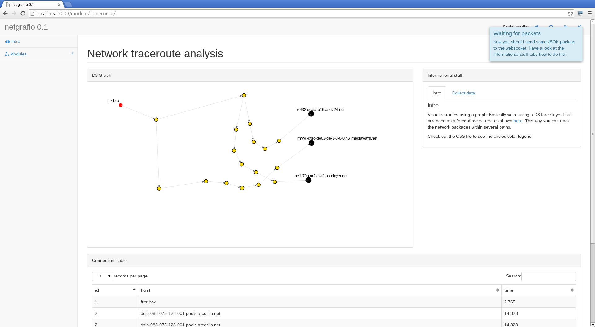

Welcome to netgrafio's documentation!
=====================================

Contents:

.. toctree::
    :maxdepth: 2

    apidoc/web
    apidoc/lib

Components
=========================

In order to understand how **netgrafio** works have a look at the following graph:

.. graphviz::

   digraph foo {
      TCPServer [shape = box, style = filled, color = yellow];
      WebSocketServer [shape = box, style = filled, color = yellow];
      FlaskApp [shape = box, style = filled, color = yellow];

      "netgrafio" -> "TCP Socket";
      "netgrafio" -> "Web Socket";
      "netgrafio" -> "Web Application";

      edge [color = red];
      "TCP Socket" -> TCPServer;
      "Web Socket" -> WebSocketServer;
      "Web Application" -> FlaskApp;

      edge [color = green];
      TCPServer -> "lib/TCPServer.py";
      WebSocketServer -> "lib/WebSocketServer.py";
      FlaskApp -> "lib/WebServer.py";
      FlaskApp -> "web/FlaskApp.py";
      FlaskApp -> "web/core/*";
      FlaskApp -> "web/mod_*/*"
   }

Quickstart
=========================

Make sure you have installed all the requirements on your system (specified in **README.md**).  Afterwards you can clone this project::

    $ git clone https://github.com/nullsecuritynet/netgrafio
    $ cd netgrafio

Now you'll need to setup a isolated python environment using *virtualenv*::

    $ virtualenv env
    Using base prefix '/usr'
    New python executable in env/bin/python3
    Also creating executable in env/bin/python
    Installing setuptools, pip...done.

Make sure to activate the virtual environment::

    $ source env/bin/activate

Having set the virtualenv environment let's install some missing packages::

    $ pip install -r env/requirements.pip

Now you're ready to start netgrafion and have some fun.

These are the basic parameters::

    $ python netgrafio.py -h
    usage: netgrafio.py [-h] [--tcp-port TCP_PORT] [--ws-port WS_PORT]
                        [--web-port WEB_PORT] [--host HOST]

    netgrafio - visualize your network

    optional arguments:
      -h, --help           show this help message and exit
      --tcp-port TCP_PORT  Specify TCP port to listen for JSON packets (default:
                           8081)
      --ws-port WS_PORT    Specify WebSocket port to send JSON data to (default:
                           8080)
      --web-port WEB_PORT  Specify web port to server web application (default:
                           5000)
      --host HOST          Specify host to bind socket on (default: 127.0.0.1)

If you start netgrafio without any arguments, then you'll have a

* *TCP-Socket* listening on port 8081
* *WebSocket* listening on port 8080
* *Web-Application* available at http://localhost:5000

After starting **netgrafio**::

    $ python netgrafio.py
    2014-04-24 16:18:12,984 - INFO - [WebSocketServer] - Starting WebSocket server on port 8080
    2014-04-24 16:18:12,984 - INFO - [WebSocketServer] - Start collector server
    2014-04-24 16:18:12,985 - INFO - [WebSocketServer] - Waiting for incoming data ...
    2014-04-24 16:18:12,989 - INFO - [WebServer] - Listening on 5000
    2014-04-24 16:18:12,989 - INFO - [TCPServer] - Listening on 8081

Now open your browser and navigate to http://localhost:5000

D3 Graph
=========================

This section describes the basic API of *d3.graph.min.js*. It describes how to
build a graph using D3.

.. toctree::
    :maxdepth: 2

.. js:class:: D3Graph(container)

    Create a new D3 graph.

    :param string container: Specify the element in the DOM where to show the graph
    :returns: Instance of class *D3Graph* (SVG element)

    Example::

        myGraph = new D3Graph("#myElement");

.. js:function:: D3Graph.init()

    Initialize the graph.

    Example::

        myGraph.init()

.. js:function:: D3Graph.start()

    Start the graph.

    Example::

        myGraph.start()

.. js:class:: D3GraphController(d3graph)

    Control the D3 graph.

    :param D3Graph d3graph: Object of type D3Graph.
    :returns: Instance of class *D3GraphController*

    Example::

        myGraph = new D3Graph("#myElement");
        graphController = new D3GraphController(myGraph);

.. js:function:: D3GraphController.addNode(nodeObject)

    Add new node to the graph.

    :param object nodeObject: Node object to be added to the graph

    Example::

            nodeObject = {
                "id": "some_unique_id"
               ,"class": "blue"
               ,"name": "This is my fancy name"
            };

            graphController.addNode(nodeObject);

.. js:function:: D3GraphController.findNode(id)

    Find node by ID.

    :param number id: ID of node to look up.
    :returns: If found the node object is returned.

.. js:function:: D3GraphController.addLink(linkObject)

    Add new link between 2 nodes.

    :param object linkObject: Link object

    Example::

            // Add nodes
            nodeObjectA = {
                "id": "A"
               ,"class": "A"
               ,"name": "B"
            };

            nodeObjectB = {
                "id": "B"
               ,"class": "B"
               ,"name": "B"
            };

            // Add link
            var linkObject = {
                "source": nodeObjectA.id,
                "target": nodeObjectB.id,
                "linkclass": "dotted"
            }

            graphController.addNode(nodeObjectA);
            graphController.addNode(nodeObjectB);
            graphController.addLink(linkObject);

.. js:function:: D3GraphController.findLink(linkObject)

    Find link by link object.

    :param object linkObject: Should contain *source* and *target*
    :returns: If found the link object is returned.

    Example::

        nodeObjectA = {"id": "A"}
        nodeObjectB = {"id": "B"}
        ...
        var linkObject = {"source": nodeObjectA, "target": nodeObjectB}
        searched_link = findLink(linkObject)
        ...

.. js:function:: D3GraphController.getNodes()

    Get array of nodes.

    :returns: Array containing all node objects

.. js:function:: D3GraphController.getLinks()

    Get array of links.

    :returns: Array containing all link objects

.. js:function:: D3GraphController.update()

    Update graph. Wrapper for *D3Graph.update()*.

.. js:function:: D3GraphController.start()

    Start graph. Wrapper for *D3Graph.start()*.

TCPServer
=========================

.. automodule:: lib.TCPServer
    :members:

WebSocketServer
=========================

.. automodule:: lib.WebSocketServer
    :members:

WebServer
=========================

.. automodule:: lib.WebServer
    :members:

Flask application
=========================

.. automodule:: web.FlaskApp
    :members:

Screenshots
=========================

  *Do a traceroute using netgrafio*

.. figure:: images/netgrafio_mod_analysis.png

  *Analyze your network traffic (LIVE!)*

.. figure:: images/netgrafio_mod_nmap.png

  *Visualize your NMap scanning results*

Indices and tables
==================

* :ref:`genindex`
* :ref:`modindex`
* :ref:`search`

